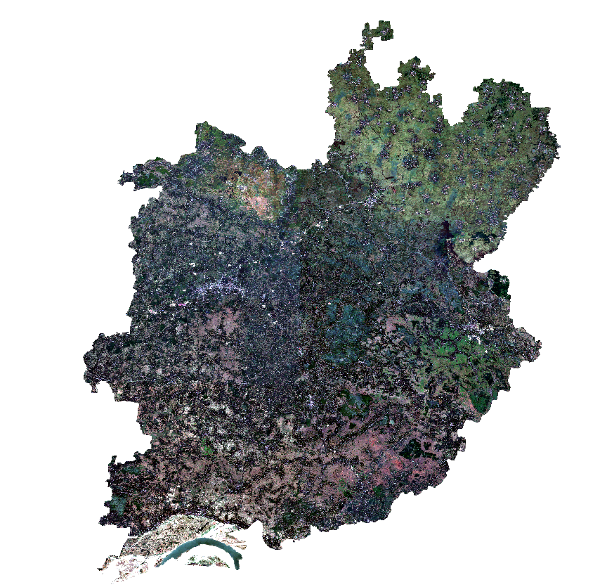

## Water Body Detection in Natore District (April–May 2025) using Sentinel-2 and Google Earth Engine

This project uses **Sentinel-2 Surface Reflectance (S2_SR)** imagery to detect **water bodies** in the **Natore District, Bangladesh** during **April–May 2025**, based on the **Normalized Difference Water Index (NDWI)**.

## Objective
To extract and visualize surface water bodies by:
- Filtering low-cloud Sentinel-2 imagery
- Creating NDWI maps
- Applying thresholds to detect water
- Exporting NDWI, RGB composites, and water masks for further use

---

## Area of Interest (AOI)

- **Region**: Natore District, Bangladesh

---

## Data and Filtering

- **Dataset**: `COPERNICUS/S2_SR` (Sentinel-2 Surface Reflectance)
- **Date Range**: `2025-04-01` to `2025-05-31`
- **Cloud Cover**: < 10%

---

## Methodology

1. **Define AOI** using FAO GAUL dataset.
2. **Filter Sentinel-2 imagery** by date and cloud percentage.
3. **Create median composite** to reduce cloud noise.
4. **Calculate NDWI** using:
   \[
   NDWI = \frac{Green - NIR}{Green + NIR} = \frac{B3 - B8}{B3 + B8}
   \]
5. **Threshold NDWI > 0.3** to extract water bodies.
6. **Visualize**:
   - True Color RGB (B4, B3, B2)
   - NDWI Map
   - Water Body Mask
7. **Export** results to Google Drive:
   - `NDWI.tif`
   - `Water_Mask.tif`
   - `RGB_Composite.tif`

---

### Image

---

## Tools Used

- [Google Earth Engine](https://earthengine.google.com/)
- Sentinel-2 (S2_SR) imagery
- NDWI algorithm
- JavaScript (GEE Code Editor)

---

## Author

**Your Name**  
[GitHub Profile](https://github.com/mdkhademali)

---

© mdkhademali